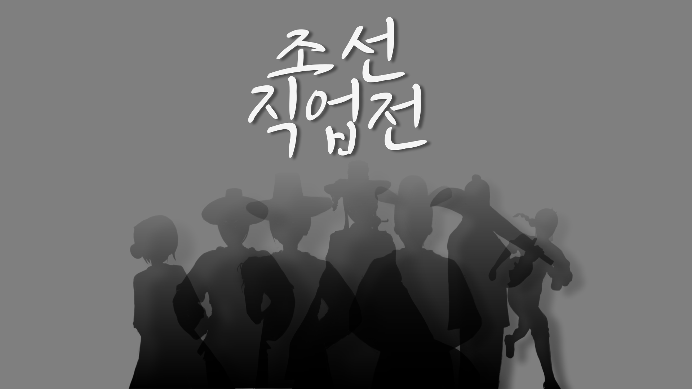
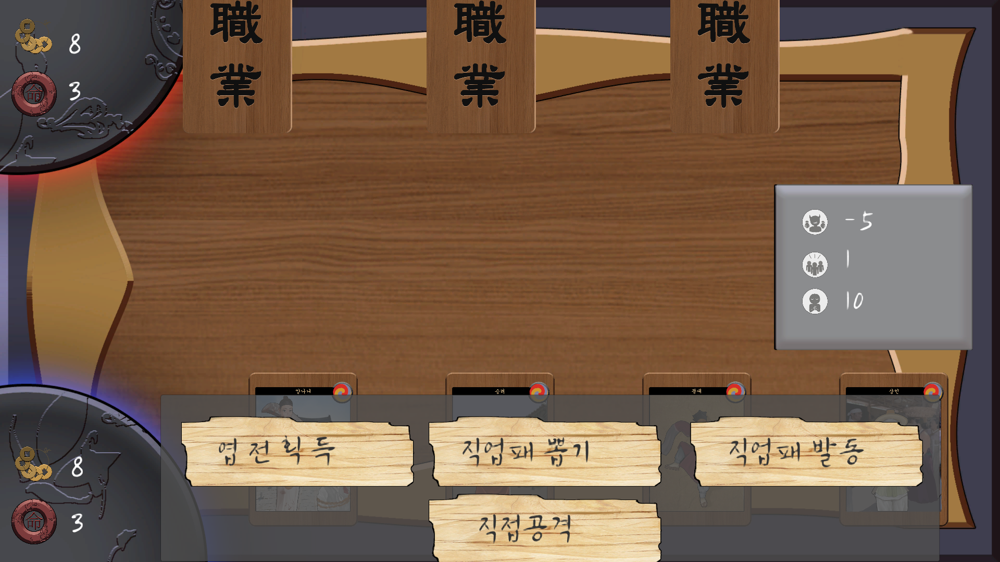

# 조선 직업전

[**다운로드 바로가기**]([https://drive.google.com/file/d/1enxRlQ1Z2qI_g0tplVDNytjug9NmIype/view?usp=sharing](https://drive.google.com/file/d/1v1FYpJn7yX-WJksaOytRBMo3socwfdTX/view?usp=sharing))

조선시대의 직업들을 주제로 한 카드들을 이용해 AI와 대결하는 전략 카드 게임입니다.

 

## 조작 방법

매 턴마다 플레이어는 엽전 획득, 직업패 뽑기, 직업패 발동, 직접 공격 중 한가지 행동을 할 수 있습니다.
단순 버튼 클릭으로 행동을 정할 수 있고, 직업패를 사용하기 전 직업패를 우클릭 하면 직업패의 효과를 알 수 있습니다.

## 게임 요소

### 엽전
엽전은 엽전 획득 또는 카드의 효과로 늘릴 수 있으며, 카드의 효과로 줄어들 수 있습니다.
엽전이 5 이상 있을 경우, 엽전 5개를 소모해 상대에게 직접공격 할 수 있습니다.

### 생명전
카드의 효과로 얻거나, 직접공격 등으로 깎이는 수치 입니다.
생명전이 0이될 시 그 턴이 끝나면서 게임이 끝나게 되며, 생명전이 남은 쪽이 승리합니다.

### 직업패
직업패는 매 턴 종료시 패에서 발동되는 상시 효과, 직업패 사용으로 발동되는 발동 효과를 가지고 있습니다.
직업패 뽑기와 사용은 각각 한턴을 소모하기 때문에 현재 자신에게 필요한 것을 잘 알아야 합니다.

### 중첩
중첩은 화면 오른쪽 가운데에 표시됩니다.
각각 치안, 인구, 신앙 중첩이며 카드의 효과로 변동합니다.
일부 카드들은 중첩을 소모하는 방식으로 사용할 수 있습니다.

 
